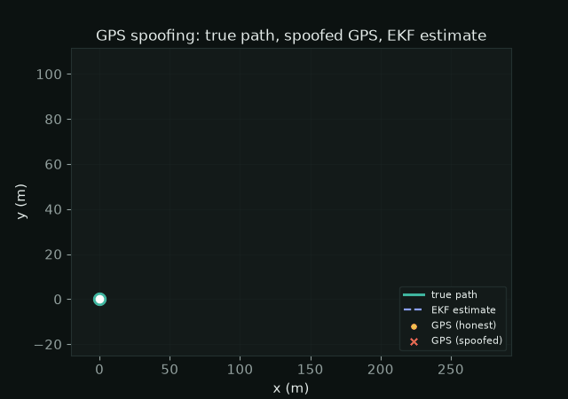
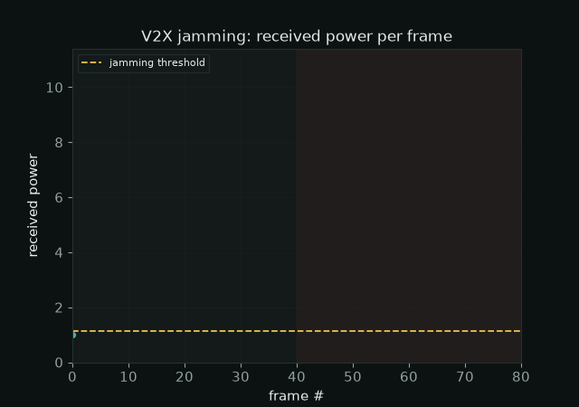
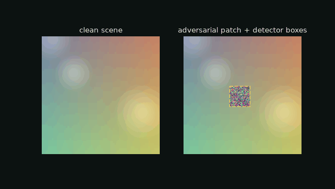
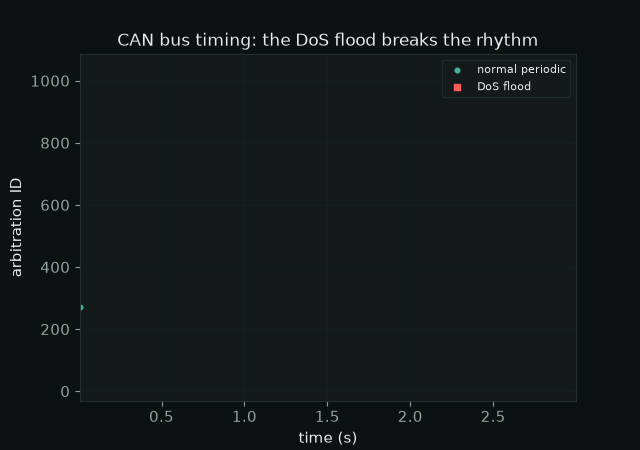
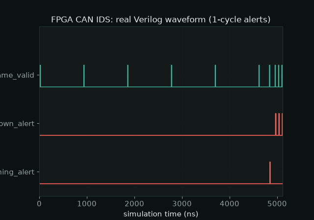

# AV Stack Defense (Cross-Layer Harness)

> **TL;DR** One umbrella that runs five autonomous-vehicle attack detectors,
> spanning perception, navigation, communication, and the in-vehicle network, and
> reports one comparable metrics table across the whole stack. The five detectors
> stay in their own repositories, unmodified. This is the integration substrate for
> studying cross-layer attack propagation.

## Quickstart

```bash
python harness.py
```

No dependencies beyond what the individual detectors already use (numpy, Pillow).
The harness runs each layer in its own subprocess and prints a comparable table.

## Live visualization

Every panel below is rendered from the real output of the real detectors on a
single run. The inputs are the projects' own simulations; the detection code and
results are genuine. Generate them yourself with `python viz/build.py` (needs
`matplotlib`), or double-click `Visualize.bat` on Windows.

**Navigation, GPS spoofing.** An EKF fuses GPS and IMU. When the GPS is spoofed
with a jump, the estimate diverges from the honest track and the chi-square test
fires.



**Communication, V2X jamming.** Received power stays under the learned threshold on
honest frames, then a tone jammer pushes it over and the alarm fires.



**Perception, adversarial patch.** The detector's boxes (red) close in on the real
patch (dashed yellow), localizing it.



**In-vehicle network, CAN flood.** Normal CAN traffic is periodic; the DoS flood
injects an unknown ID far too fast, breaking the rhythm the timing IDS keys on.



**Hardware, FPGA CAN IDS.** The real Verilog waveform from the simulation. When an
attack frame arrives, the alert line pulses within one clock cycle.



## What this is

Five separate projects each defend one layer of a connected autonomous vehicle:

| Layer | Repository | Defends |
|---|---|---|
| Perception | `adversarial-patch-detector` | camera against adversarial patches |
| Navigation | `ekf-gps-spoof-detector` | GPS/IMU against spoofing |
| Communication | `v2x-jamming-detector` | V2X radio against RF jamming |
| In-vehicle network (software) | `canbus-ids` | CAN bus against injection and flooding |
| In-vehicle network (hardware) | `canbus-ids-fpga` | CAN bus in synthesizable Verilog |

On their own they are five demos. This umbrella runs them through one common
interface so their results are directly comparable, which is the first step toward
a coordinated cross-layer defense. See `ARCHITECTURE.md` for the layer-by-layer
mapping and the cross-layer thesis.

## Example run

```
Layer                             Attack                 clean FA   detect
------------------------------------------------------------------------------
Perception (camera / VLM input)   adversarial patch         0.000    1.000
Navigation (GPS + IMU fusion)     GPS spoof (jump)          0.000    1.000
Communication (V2X radio)         RF jamming (tone)         0.000    1.000
In-vehicle network (CAN, softw.)  flooding / DoS            0.000    1.000
In-vehicle network (CAN, FPGA)    CAN injection + flood         -        -   (needs Icarus Verilog)
```

`clean FA` is the false-alarm rate on clean input; `detect` is the detection rate
on the attack. The numbers are captured live and written to `results.json`.

## How it works

```
av-stack-defense/
├─ harness.py            # runs every layer, prints the comparable table, writes results.json
├─ drivers/
│   ├─ perception.py     # adversarial-patch-detector: clean scene vs patched scene
│   ├─ navigation.py     # ekf-gps-spoof-detector: clean drive vs jump spoof
│   ├─ communication.py  # v2x-jamming-detector: clean frames vs tone jammer
│   ├─ invehicle_can.py  # canbus-ids: clean traffic vs DoS flood
│   └─ invehicle_fpga.py # canbus-ids-fpga: Icarus Verilog testbench (optional)
└─ ARCHITECTURE.md       # layer mapping, cross-layer thesis, scope
```

Each driver adds its target repository to a subprocess path and calls that repo's
own detector. The repositories are never modified, and their local `core` packages
never collide because each runs in isolation.

The five detector repositories must sit alongside this folder (one level up).

## Honest scope

- This harness proves each layer detects its own attack through one shared
  interface. It does **not** yet inject a single attack that spans layers, and it
  does **not** yet fuse the per-layer signals into a joint decision. Those are the
  research steps, described in `ARCHITECTURE.md`, and they are intentionally not
  claimed as done here.
- The FPGA layer is reported as skipped, not failed, when Icarus Verilog is absent.
- To run everything including hardware: `winget install Icarus.Verilog`.
